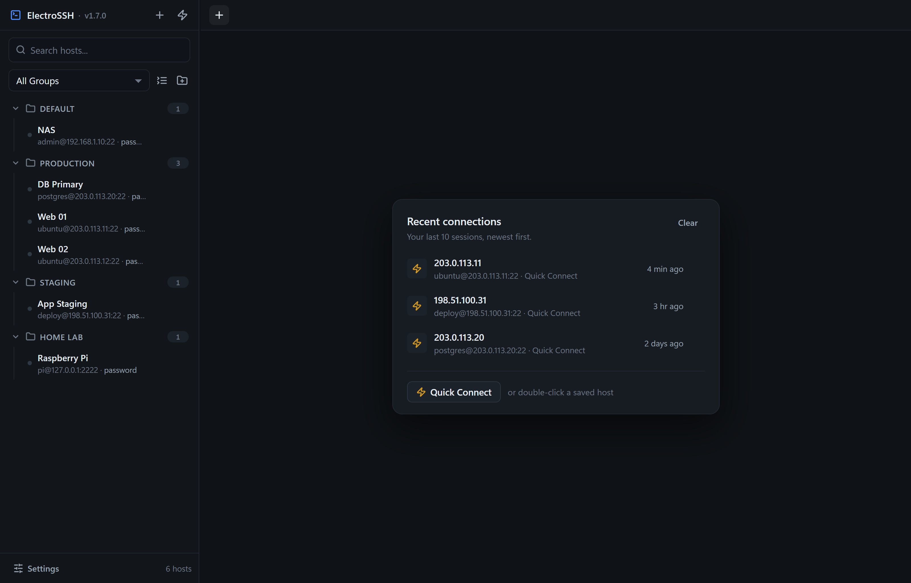
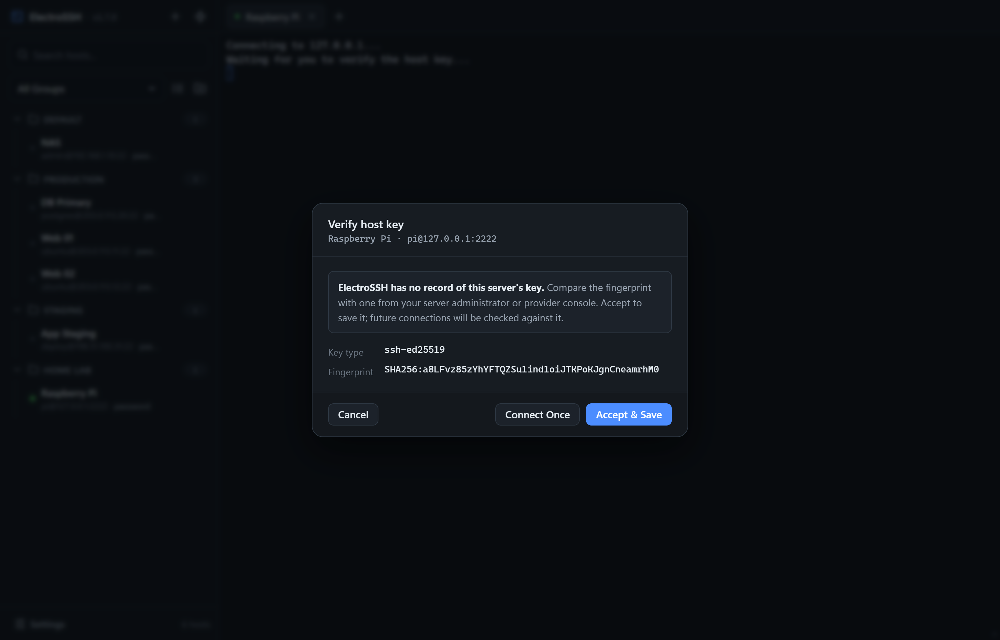
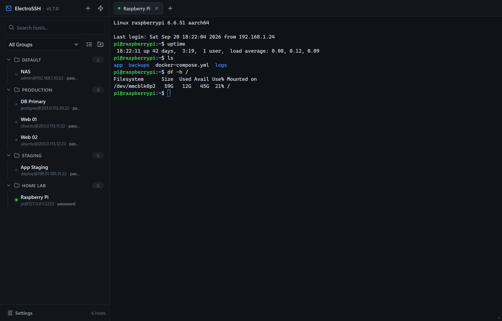
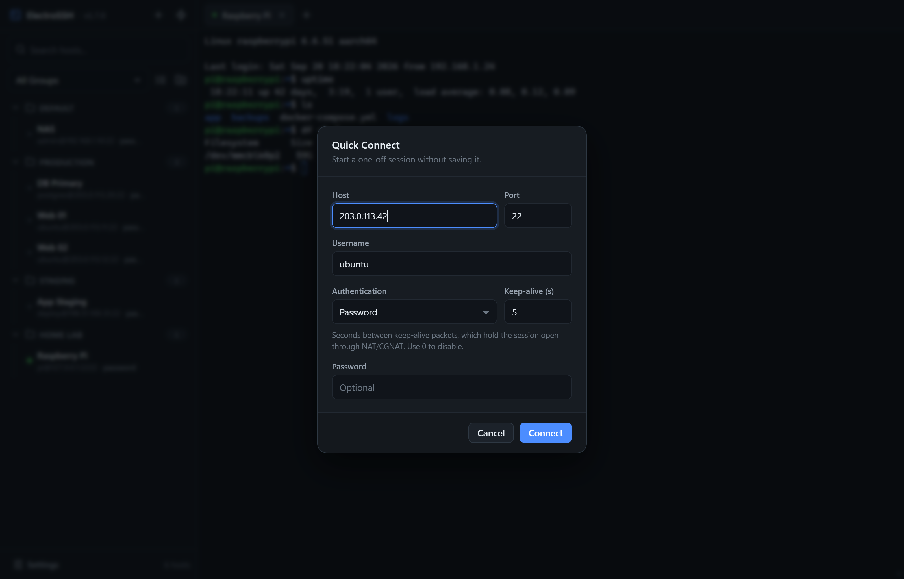
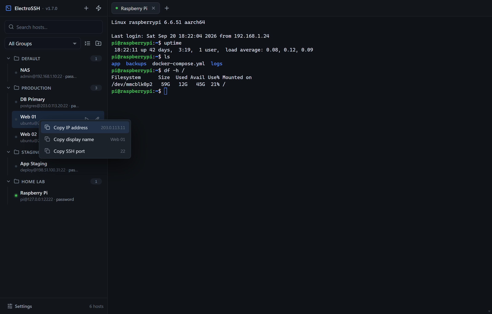

# ElectroSSH
Electron powered SSH application with Tabs and SSH Key support

> [!WARNING]
> Passwords saved against a host are stored in clear text currently. Please use with caution. Quick Connect asks for the password each time and never writes it to disk, and the recent connections list holds no passwords either.

## Screenshots

The hosts shown are made up, and the addresses come from the ranges reserved for documentation.

### The host tree and recent connections

Saved hosts on the left, grouped however you like; the home view lists your last 10 sessions.



### Host key verification

The first connection to a server shows its fingerprint. Later connections are checked against what you accepted, and a changed key is flagged.



### Connecting to a host

Double click a host to launch the session.



### Quick Connect

For a one-off session you don't want to save. The password is never written to disk.



### Copying a host's details

Right-click a saved host for its IP address, display name or SSH port.



What works:

- [x] Modern dark UI with a collapsible host tree in the sidebar
- [x] Adding Hosts
- [x] Editing Hosts
- [X] Deleting Hosts
- [X] Adding Groups/Categories
- [x] Renaming Groups/Categories (pencil icon in the sidebar, or F2)
- [x] Deleting Groups/Categories (only when the group has no hosts under it)
- [x] Searching Hosts 
- [x] Right-click a saved host to copy its IP address, display name or SSH port
- [x] Recent connections on the home view: your last 10 sessions, newest first, one click to reconnect
- [x] Quick Connect for one-off sessions: the lightning button in the sidebar, or Ctrl+Shift+N (Cmd+N on macOS)
- [X] SSH Keys
- [x] Host key verification: asks before trusting a new server, and warns loudly if a known server's key changes
- [x] Passphrase-protected SSH keys: the passphrase is asked for when needed and never saved
- [x] Keyboard-interactive and two-factor login: one-time code prompts are shown as the server words them
- [X] Right click to paste (or Ctrl+Shift+V)
- [x] Left click select to copy (or Ctrl+Shift+C)
- [x] Clickable links in terminal output: Ctrl+click (Cmd+click on macOS) opens http/https links in your browser
- [x] Find in terminal: Ctrl+Shift+F (Cmd+F on macOS), with match case and regex options
- [x] Terminal font size: Ctrl+= / Ctrl+- / Ctrl+0, or Ctrl+mouse wheel (remembered between sessions)
- [x] Keyboard shortcuts reference in Settings (also under the Settings menu)
- [x] Reconnect option when connection disconnects
- [x] Connection status at a glance: amber while connecting, green when live, red when dropped
- [x] Closing or reloading the app asks for confirmation while SSH sessions are open
- [x] Closing a tab asks for confirmation while its session is connected
- [x] SSH Keepalive for NAT/CGNAT users (per saved host and per Quick Connect session, defaults to every 5 seconds, set 0 to disable)
- [x] Color supported in the console (for htop etc)
- [x] Collapse/expand hosts listed under a Group/Category (state is remembered)
- [x] Resizable sidebar
- [x] App version shown beside the name in the sidebar

What doesn't work/needs work (contributors welcome!):

- [ ] Encrypting passwords saved (the likely route is Electron's `safeStorage`, which encrypts with a key held by your OS account: DPAPI on Windows, the Keychain on macOS, the keyring on Linux)
- [ ] Dark/Light Mode Themes
- [ ] Auto save console log to file on connection
- [ ] Ability to sort the order of the Group/Categories
- [ ] Ability to pin/star/favourite a Group/Category to the top of the list

## Terminal engine

The terminal is [xterm.js](https://github.com/xtermjs/xterm.js) 6 (`@xterm/xterm`) with the fit, WebGL, search and web-links addons. The unscoped `xterm`/`xterm-addon-*` packages it used previously are deprecated.

Icons are [Lucide](https://lucide.dev) shapes, written inline as SVG; no icon library or font is loaded.

## Building/Installing the application

> [!TIP]
> This is required only if building the latest version of the application off GitHub or if there's no build available for your operating system


```
npm install
```

```
npm run dist:win
```

## Running/building the application from source

Required only the first time

```
npm install
```

and then to run,

```
npm start
```

or to build an exe for example on Windows,

```
npm run dist:win
```


## Running the tests

```
npm test            # main-process tests (a few seconds)
npm run test:slow   # the handshake-timeout test (about 25 seconds)
npm run test:e2e    # end-to-end tests; the app window opens briefly for each file
npm run test:all    # everything
```

The tests run against local SSH servers they start themselves, so no network access or real host is needed.


